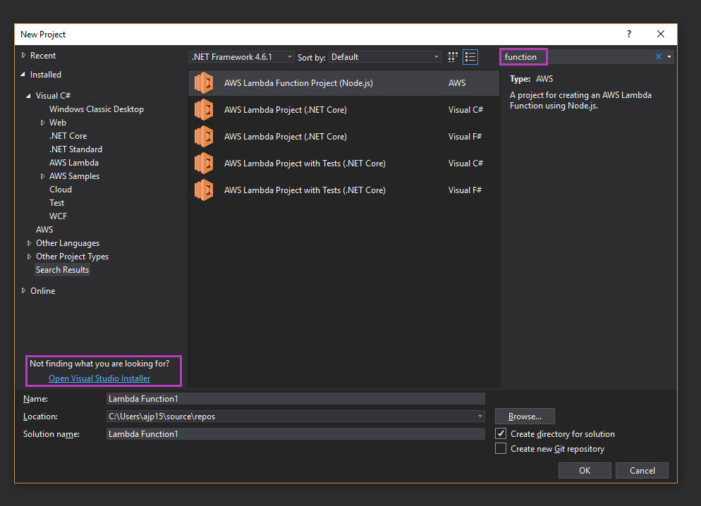
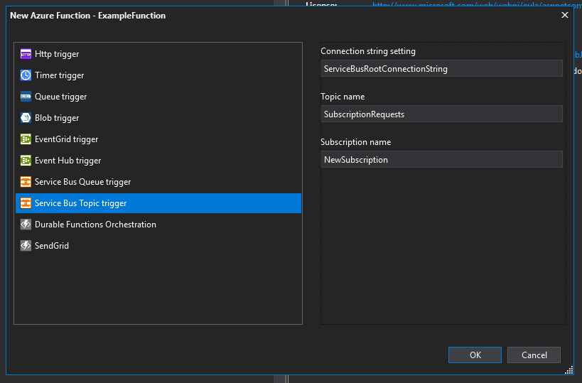
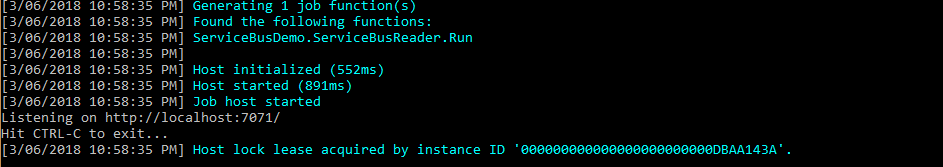
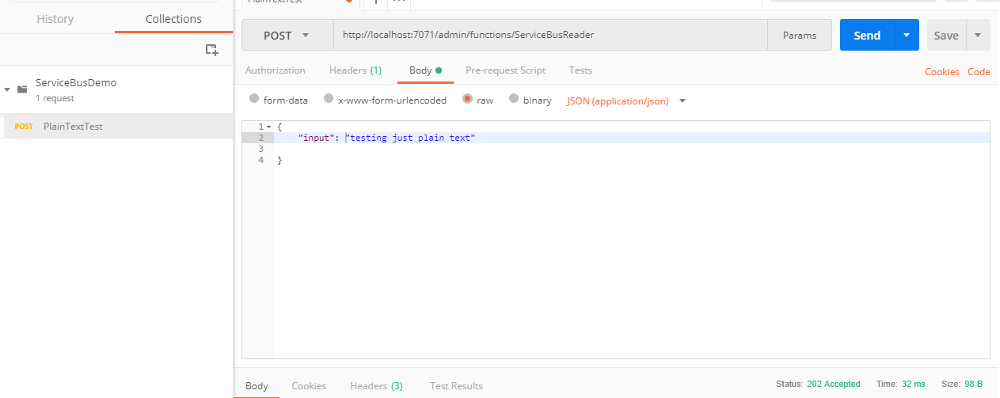
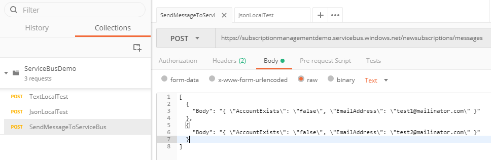
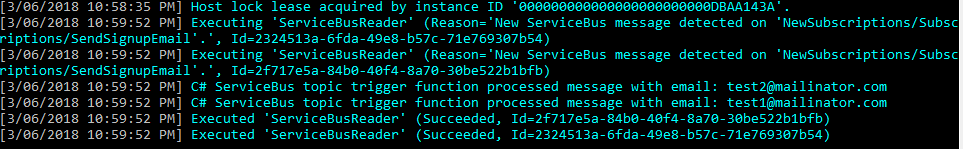

import Aside from '../../components/Aside.astro'

<Aside title="Retired" type="caution">

This article was written in 2018, so the information may no longer be relevant today.

</Aside>

This post will give you a run down of how to setup an azure function in C# using .net core, visual studio 2017 and azure. I'm a pretty verbose sort of person since
it's so easy to get stuck because you missed a single step but if you're just after the code and project config feel free to scroll past all the setup steps.

## Setting up

So first things first make sure you have a copy of visual studio 2017 installed, pervious versions do not support the project template for azure functions. For the purpose of this article I was using a community edition but any edition should work the same. When I first tried to create an azure function project in visual studio I found I hadn't installed the azure tools so the template didn't exist inside the new project wizard. No worries there's a link on the new project wizard which opens the visual studio installer, from here I just needed to select the azure development workflow.



Once that was installed when I search "azure function" in the new project wizard it shows up and I'm then able to create an azure function project. At the time of writing this the wizard does not provide a service bus topic option so you'll have to create an empty project and then you can right click -> add new function and select service bus topic from the list.



This will create something similar to the following, one change that I made was to use the `Microsoft.Extensions.ILogger` instead of the `TraceWriter`. The Microsoft team appear to be working on a way to utilize dependency injection but that might be a while off but it doesn't stop us from setting up our code to handle it when it is supported.

```csharp
public static class ServiceBusReader
{
    [FunctionName("ServiceBusReader")]
    public static void Run(
        [ServiceBusTrigger("NewSubscriptions", "SendSignupEmail", Connection = "ServiceBusRootConnectionString")] string mySbMsg, 
        ILogger log)
    {
        log.LogInformation($"C# ServiceBus topic trigger function processed message: {mySbMsg}");
    }
}
```

Azure functions use a local file called local.settings.json, this allows you to define AppSettings, connectionStrings and custom host.json configuration when running locally. This file doesn't get uploaded to azure and it doesn't get checked into source control. This ensures that developers aren't going to check in any passwords to source control which is a great move in my opinion. It would be nice to have a settings.schema.json which contained a definition for what the settings should look like but putting this stuff in a readme works for now.

In order to get the code to work I needed to modify the local.settings.json file to provide the "ServiceBusConnectionString" parameter, this parameter has to be added under the Values section and match the `Connection` parameter passed into the `ServiceBusTrigger` attribute. I also added a host property, the host property allows you to define custom host configuration while running locally, in this we've set that we only want to run a single function at a time and that we want to use the `ILogger` for information and error calls. The host parameters configuration if desired inside the azure environment should be placed inside the `host.json` file.

```json
{
    "IsEncrypted": false,
    "Values": {
        "AzureWebJobsStorage": "UseDevelopmentStorage=true",
        "AzureWebJobsDashboard": "UseDevelopmentStorage=true",
        "ServiceBusRootConnectionString": "<RootConnectionString>"
    },
    "Host": {
        "serviceBus": {
            "maxConcurrentCalls": 1,
            "prefetchCount": 0,
            "autoRenewTimeout": "00:05:00"
        },
        "logger": {
            "categoryFilter": {
                "defaultLevel": "Information",
                "categoryLevels": {
                    "Host": "Error",
                    "Function": "Error",
                    "Host.Aggregator": "Information"
                }
            }
        }
    }
}
```

## Testing locally

After I got this setup, the first step was to get it running on my local machine. I had hoped to set this up without using an actual azure service bus but unfortunately it doesn't look like there's an emulator for the service bus currently. The function requires a valid connection string as well, since the initialization checks for null and empty strings. Even passing fake values resulted in further validation errors. I ended up giving in and adding an actual service bus connection string but if there's a way to fake this please let me know.



Success! I now have a function running on my local machine on port 7071, now all I need to do is trigger it. In the above function we are using the parameter `string mySbMsg` so we are only providing a string. Azure functions has a special url for testing functions via http calls. We just need to do a post web call in postman as follows

|        |                                                        | 
| ---    | -------------------------------------------------------|
| Url    | http://localhost{port}/admin/functions/{functionName}  |
| Body   | ` { "input": "test plain text message" } `             |
| ContentType | application/json                                  |



This should cause the console from the running azure function to output a message. You now have tested that the function is running locally and you're able to trigger the code within it. It is possible to use a custom class as a parameter to your azure function and it will get deserialized before your code is called but that requires the message to be sent to the service bus in a particular format, so for now I'm going to concentrate on getting a `byte[]`. Another reason for not using a custom object is that you might find you don't want to use Json for serializing your data but rather a non human readable format to reduce your message size.

In order to read a meaningful object from the `byte[]` we want to deserialize it and add some logic around it, for now I've just added some logging for different conditions.

```csharp
public static class ServiceBusReader
{
    [FunctionName("ServiceBusReader")]
    public static void Run(
        [ServiceBusTrigger("NewSubscriptions", "SendSignupEmail", Connection = "ServiceBusRootConnectionString")] byte[] structuredMessage, 
        ILogger log)
    {
        SignupInformation newAccount = DeserializeJsonMessage<SignupInformation>(structuredMessage);

        if (newAccount.AccountExists)
        {
            log.LogInformation("fix the filter on your subscription to prevent this.");
        }

        log.LogInformation($"C# ServiceBus topic trigger function processed message with email: {newAccount.EmailAddress}");
    }

    private static T DeserializeJsonMessage<T>(byte[] message)
    {
        string jsonContent = Encoding.UTF8.GetString(message);
        return JsonConvert.DeserializeObject<T>(jsonContent);
    }
}

public class SignupInformation
{
    public bool AccountExists { get; set; }
    public string EmailAddress { get; set; }
}
```

I then need to update my postman content to match this new data type as follows, notice how the input is still a string so you'll need to escape the quote characters.

```json
{
    "input":
        "{
            \"AccountExists\": \"false\",
            \"EmailAddress\": \"test@mailinator.com\"    	    	
        }"
}    
```

that's all the functionally required to confirm it can be triggered from the admin url, now it's time to trigger off an actual service bus.

In order to send messages to my Azure service bus topic I want to use postman so I can trigger my local function through the admin portal or service bus from a single location. unfortunately it's not the simplest process, in order to authenticate with the service bus REST API you need a Shared Access Signature (SAS). The azure portal has a feature to create one of these for an Azure storage account but I couldn't find anything to do this for the service bus. Shared Access Signatures aren't simple and are deserving of their own post but I ended up making a console application based off [this project](https://code.msdn.microsoft.com/Using-Shared-Access-e605b37c/sourcecode?fileId=91232&pathId=148562433) that generates signatures.



With signature in hand I could create a simple postman call which would add one to many messages on my topic, this results in triggering the function locally. I've now confirmed my function can be triggered from both the service bus and from local http triggers. In my next post I plan on going through how to setup your code base with azure to automate deployment and testing of the function.



I hope that this article helps someone troubleshoot an issue they're having with setting up their azure function. Once you are through the initial setup azure functions become very simple but at the same time very powerful. All the code for the azure function, the shared access signature Generator and the postman collections are accessible from my Github.


## Useful Links

 Url | Description
------------ | -------------
[https://github.com/Azure/azure-webjobs-sdk/wiki/ServiceBus-Serialization-Scenarios](https://github.com/Azure/azure-webjobs-sdk/wiki/ServiceBus-Serialization-Scenarios) | service bus parameters and how to create them.
[https://github.com/Azure/azure-webjobs-sdk/issues/979](https://github.com/Azure/azure-webjobs-sdk/issues/979) | issue with POCO requiring special creating rather than just working with JSON data.
[https://docs.microsoft.com/en-us/azure/azure-functions/functions-host-json](https://docs.microsoft.com/en-us/azure/azure-functions/functions-host-json) | host docs
[https://docs.microsoft.com/en-us/azure/azure-functions/functions-run-local](https://docs.microsoft.com/en-us/azure/azure-functions/functions-run-local) | core tools for local docs   
[https://docs.microsoft.com/en-us/azure/azure-functions/functions-run-local#local-settings-file](https://docs.microsoft.com/en-us/azure/azure-functions/functions-run-local#local-settings-file) | local settings docs.
[https://code.msdn.microsoft.com/Using-Shared-Access-e605b37c/sourcecode?fileId=91232&pathId=148562433](https://code.msdn.microsoft.com/Using-Shared-Access-e605b37c/sourcecode?fileId=91232&pathId=148562433) | Project showing how to generate SAS
[https://docs.microsoft.com/en-nz/rest/api/servicebus/send-message-batch](https://docs.microsoft.com/en-nz/rest/api/servicebus/send-message-batch) | Documentation on sending batch message (content-type is wrong as stated in comments.)
